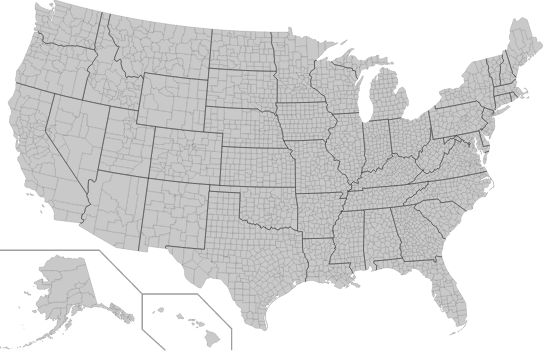

# Airport Delays
Data Engineering project using U.S. Department of Transportation Federal Aviation Administration delays API.

The live site is located at:
[Delay.io](http://best-first-flask.us-west-1.elasticbeanstalk.com/)

## Architecture

![Data Pipeline][architecture]

[architecture]: /images/architecture.png "Data Pipeline"

# Dataset

I will be working with delay information from the <u>top 20 busiest US airports</u> according to **"Calendar Year 2015 Revenue Enplanements at Commercial Service Airports" (PDF). Federal Aviation Administration.**

| Rank | Name   | IATA code | City Served | 2015 |
|------|---------------|-----------|------|-------|
| 1	   |Hartsfield–Jackson Atlanta International Airport|	ATL	| Atlanta	GA |	49,340,732 |
|2	| Los Angeles International Airport|	LAX	|Los Angeles	CA	|36,351,226	|
|3	|O'Hare International Airport |	ORD	| Chicago	IL	| 36,305,668 |		
|4	| Dallas/Fort Worth International Airport |	DFW	| Dallas/Fort Worth	TX |	31,589,832 |		
|5	|John F. Kennedy International Airport |	JFK |	New York	NY |	27,717,503		|
|6	|Denver International Airport |	DEN	 | Denver	CO	| 26,280,043		|
|7	|San Francisco International Airport |	SFO |	San Francisco	CA |	24,190,549		|
|8	|Charlotte Douglas International Airport |	CLT	| Charlotte	NC |	21,913,156		|
|9	|McCarran International Airport |	LAS	| Las Vegas	NV |	21,824,231		|
|10|	Phoenix Sky Harbor International Airport	| PHX	| Phoenix	AZ	| 21,351,445		|
|11|	Miami International Airport |	MIA	| Miami	FL	| 20,986,341		|
|12|	George Bush Intercontinental Airport |	IAH	 | Houston	TX	 | 20,595,874		|
|13|	Seattle–Tacoma International Airport |	SEA	| Seattle/Tacoma	WA |	20,148,980		|
|14|	Orlando International Airport |	MCO	| Orlando	FL	| 18,759,938		|
|15|	Newark Liberty International Airport |	EWR |	Newark/New York	NJ |	18,684,765		|
|16|	Minneapolis–Saint Paul International Airport |	MSP	| Minneapolis/St. Paul	MN |	17,634,252		|
|17|	Logan International Airport	| BOS	| Boston	MA	| 16,290,323		|
|18|	Detroit Metropolitan Airport |	DTW	| Detroit	MI | 16,255,507		|
|19|	Philadelphia International Airport | PHL	| Philadelphia	PA |	15,101,318		|
|20|	LaGuardia Airport |	LGA	 | New York	NY	| 14,319,924 |

## Objective

[architecture]: /images/architecture.png "Data Pipeline"

The output of the project will be a website containing a map with the status of the airports and historical information.

Each dot will be:
+ green: if there are no delays
+ red: if delays have been reported
The user can click on the airport and see:
Stage 1: additional details about the delay.
Stage 2: twitter feed of the airport in question.
Stage 3: Historical information on delays on the airport (average delay for the past two weeks and a chart that shows a day log of delays for the past 2 weeks.
Stage 4: Using the historical information and forecasted weather, predict if there will be a delay.
